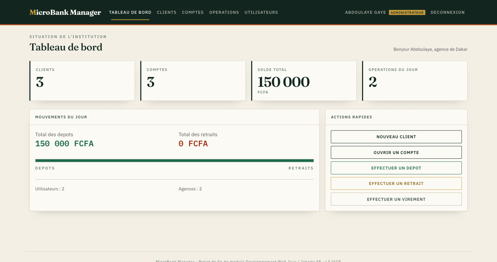
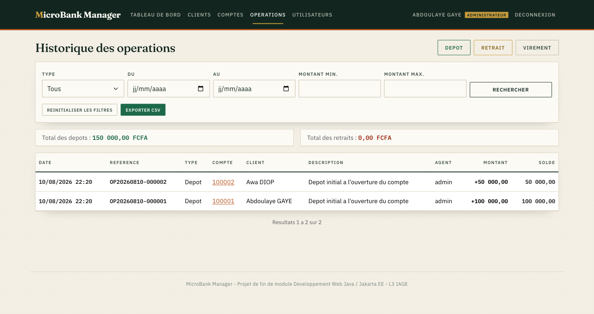

<div align="center">

# MicroBank Manager

**Application web de gestion d'une institution de microfinance.**
Clients, comptes, depots, retraits, virements, releves PDF et exports CSV.


Projet de fin de module — **Developpement Web Java / Jakarta EE**
Licence 3 IAGE · Annee academique 2025 / 2026

</div>

---



---

## Ce que fait l'application

- **Guichet complet** — depot, retrait et virement de compte a compte, avec les regles
  metier appliquees a chaque operation (montant positif, compte actif, solde suffisant).
- **Integrite garantie** — un virement debite, credite et journalise dans **une seule
  transaction** ; a la moindre erreur, tout est annule et aucun compte ne bouge.
- **Historique exploitable** — filtres combinables par type, periode et montant,
  pagination cote base de donnees, totaux des depots et des retraits.
- **Documents officiels** — releve de compte au format PDF et export CSV de l'historique,
  qui conservent les filtres affiches a l'ecran.
- **Acces controle** — authentification par session, pages protegees par filtre,
  gestion des utilisateurs reservee aux administrateurs.
- **Fonctionne hors ligne** — Bootstrap, polices et scripts sont embarques dans le WAR :
  aucune connexion internet requise pour la demonstration.

---

## Demarrage rapide

```bash
# 1. Creer la base et son jeu de donnees
createdb microbank
psql -d microbank -f database.sql

# 2. Lancer l'application (aucun serveur a installer)
mvn jetty:run
```

Ouvrir <http://localhost:8080/microbank/login> et se connecter avec `admin` / `admin123`.

---

## Comptes de test

| Login | Mot de passe | Role | Droits |
|---|---|---|---|
| `admin` | `admin123` | ADMIN | Tout, y compris la gestion des utilisateurs |
| `agent` | `agent123` | AGENT | Clients, comptes, operations, releves |

Les mots de passe ne sont jamais stockes en clair : la base contient une empreinte
PBKDF2-HMAC-SHA256 (120 000 iterations, sel aleatoire par utilisateur).
Si la table `users` est vide au demarrage, l'application recree ces deux comptes.

---

## Parcours de demonstration

| # | Etape | Ou |
|---|---|---|
| 1 | Connexion | `/login` |
| 2 | Tableau de bord : clients, comptes, solde total, operations du jour | `/dashboard` |
| 3 | Creer un client, puis rechercher et paginer la liste | `/clients` |
| 4 | Ouvrir un compte avec un depot initial | `/accounts/nouveau` |
| 5 | Effectuer un depot, un retrait, puis un virement | `/operations/deposit` … |
| 6 | Consulter l'historique et appliquer les filtres | `/operations?accountId=1` |
| 7 | Telecharger le releve PDF, puis exporter en CSV | boutons de l'historique |
| 8 | Gerer les utilisateurs, activer ou desactiver un compte | `/users` (ADMIN) |



---

## Prerequis

| Outil | Version | Verification |
|---|---|---|
| JDK | 17 ou superieur | `java -version` |
| Maven | 3.8 ou superieur | `mvn -version` |
| PostgreSQL | 13 ou superieur | `psql --version` |

Aucun serveur d'application n'a besoin d'etre installe : le plugin Maven Jetty embarque
le serveur. Un WAR deployable sur Tomcat 10.1 est egalement produit.

> Le projet compile en bytecode Java 17 (`maven.compiler.release`) : il fonctionne sur un
> JDK recent tout en restant lisible par le compilateur de JSP du serveur.

---

## Installation detaillee

### 1. Base de donnees

```bash
createdb microbank
psql -d microbank -f database.sql
```

Le script cree les six tables, leurs contraintes et leurs index, puis insere un jeu de
donnees de depart : 2 utilisateurs, 2 agences, 3 clients, 3 comptes, 2 operations.

```bash
# Verification
psql -d microbank -c "SELECT login, role FROM users;"
```

### 2. Configuration de persistence.xml

Le fichier `src/main/resources/META-INF/persistence.xml` contient l'unite de persistance
`microbank-pu`. Adapter les trois lignes de connexion au poste :

```xml
<property name="jakarta.persistence.jdbc.url"
          value="jdbc:postgresql://localhost:5432/microbank"/>
<property name="jakarta.persistence.jdbc.user"     value="postgres"/>
<property name="jakarta.persistence.jdbc.password" value="votre_mot_de_passe"/>
```

| Propriete | Valeur livree | Role |
|---|---|---|
| `hibernate.dialect` | `PostgreSQLDialect` | Dialecte SQL genere par Hibernate |
| `hibernate.hbm2ddl.auto` | `update` | Complete le schema si une table manque |
| `hibernate.show_sql` | `true` | Affiche les requetes SQL dans la console |

Le schema de reference reste `database.sql`. Passer `hbm2ddl.auto` a `validate` permet de
verifier que la base correspond exactement aux entites.

### 3. Lancement

```bash
mvn jetty:run                     # developpement : http://localhost:8080/microbank/login
```

```bash
mvn clean package                 # production
cp target/microbank.war $CATALINA_HOME/webapps/
```

> Tomcat 10.1 est requis (Jakarta EE 10, paquets `jakarta.*`). Tomcat 9 ne convient pas.

---

## Architecture

```
Navigateur
    |
[ Filtre ]     AuthenticationFilter : session obligatoire
    |          AdminAuthorizationFilter : /users/* reserve aux ADMIN
[ Controleur ] Servlets : lisent la requete, appellent un service, choisissent la vue
    |
[ Service ]    Regles metier + perimetre des transactions (begin / commit / rollback)
    |
[ DAO ]        Requetes JPQL, recoit l'EntityManager, n'ouvre aucune transaction
    |
[ JPA ]        Hibernate --> PostgreSQL
```

Relations du modele :

```
User 1 ────* Operation
Client 1 ───* Account 1 ───* Operation
Client 1 ───1 ClientDocument          Agency 1 ───* Account
```

<details>
<summary><strong>Arborescence du projet</strong></summary>

```
src/main/java/sn/isi/iage/microbank/
├── config/       DatabaseSeedListener (demarrage et arret de l'application)
├── controller/   Servlets : Login, Logout, Dashboard, Client, Account, Operation,
│                 User, StatementPdf, OperationCsvExport, ClientDocument
├── dao/          Couche d'acces aux donnees + JpaUtil + TransactionExecutor
├── dto/          PageResult, formulaires, criteres de recherche
├── model/        Entites JPA : User, Client, ClientDocument, Agency, Account, Operation
├── enums/        Role, Statut, TypeCompte, StatutCompte, TypeOperation, SensOperation
├── exception/    BusinessRuleException, ValidationException, ResourceNotFoundException
├── filter/       AuthenticationFilter, AdminAuthorizationFilter
├── service/      Regles metier et perimetre des transactions
└── util/         PasswordHasher, FormValidator, ValueParser, CsrfTokenManager,
                  AmountFormatter, StatementPdfWriter, OperationCsvWriter

src/main/webapp/
├── assets/
│   ├── css/      Bootstrap 5.3, microbank.css (identite visuelle), polices.css
│   ├── fonts/    Fraunces et IBM Plex embarques (licence SIL OFL 1.1)
│   └── js/       Bootstrap bundle
└── WEB-INF/
    ├── web.xml           Sessions, pages d'erreur, declaration du taglib
    ├── microbank.tld     Fonctions de formatage utilisables dans les JSP
    └── views/            login, dashboard, clients/, accounts/, operations/, users/
```

</details>

<details>
<summary><strong>Principales URL</strong></summary>

| Methode | URL | Role |
|---|---|---|
| GET / POST | `/login` | Formulaire de connexion |
| GET | `/logout` | Deconnexion |
| GET | `/dashboard` | Tableau de bord |
| GET | `/clients?search=&page=0&size=10` | Liste, recherche et pagination |
| POST | `/clients/create`, `/clients/update` | Creation et modification |
| GET | `/clients/details?id=`, `/clients/delete?id=` | Consultation et suppression |
| POST / GET | `/clients/document` | Depot et consultation de la piece d'identite |
| GET | `/accounts`, `/accounts/details?id=` | Comptes |
| POST | `/accounts/create`, `/accounts/statut` | Ouverture, changement de statut |
| POST | `/operations/deposit`, `/withdraw`, `/transfer` | Operations bancaires |
| GET | `/operations?accountId=&type=&dateDebut=&dateFin=&page=&size=` | Historique filtre |
| GET | `/operations/statement.pdf?accountId=` | Releve PDF |
| GET | `/operations/export.csv?accountId=` | Export CSV |
| GET / POST | `/users` | Gestion des utilisateurs (ADMIN) |

</details>

---

## Interface

Bootstrap 5.3 fournit la grille et les composants ; `assets/css/microbank.css` pose
l'identite visuelle par-dessus, sans modifier le balisage des JSP.

Parti pris : **un registre comptable edite**, pas un tableau de bord generique.

| Choix | Raison |
|---|---|
| Fond papier chaud, encre vert foret, accent terre cuite | Identite sobre et institutionnelle |
| Titres en Fraunces, texte en IBM Plex Sans | Une serif de caractere, une sans technique pour la lecture |
| Montants, dates et references en IBM Plex Mono | Chiffres tabulaires : les colonnes s'alignent comme dans un livre de comptes |
| Vert pour les credits, rouge hachure pour les debits | Le sens d'un mouvement se lit sans lire le libelle |
| Polices, CSS et JS embarques dans le WAR | La demonstration fonctionne sans connexion internet |

Les animations se limitent a l'ouverture de page et sont desactivees si le systeme
demande `prefers-reduced-motion`.

---

## Documentation

| Document | Contenu |
|---|---|
| [`docs/documentation.md`](docs/documentation.md) | Architecture MVC, modele de donnees, fonctionnalites, difficultes rencontrees |
| [`database.sql`](database.sql) | Schema complet commente, index, contraintes et jeu de donnees |
| [`tasks/todo.md`](tasks/todo.md) | Plan d'implementation et decisions techniques |

---

<div align="center">
<sub>Projet academique — Licence 3 IAGE, 2025 / 2026</sub>
</div>
